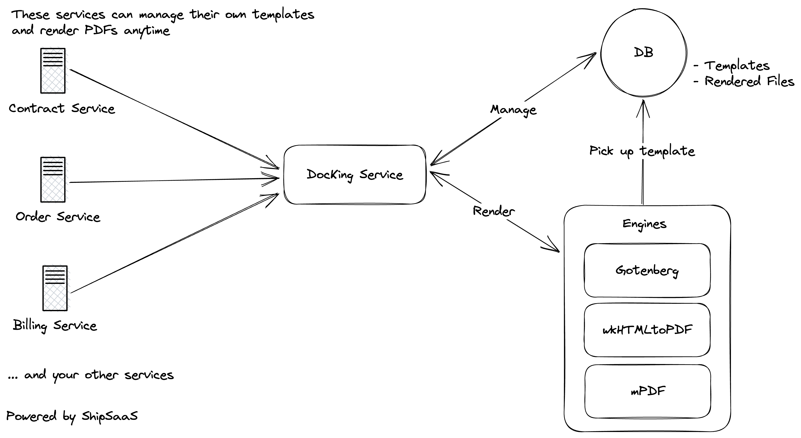

# DocKing from ShipSaaS

     

DocKing is a document management service/microservice that handles templates and renders them in PDF format, all in one place.

You can utilize DocKing as a shared microservice, which can be integrated & used in any services from your big product.

Documentation: [DocKing](https://docking.shipsaas.tech)

DocKing is well-tested & production-ready 😉🏎️🚀

## LIVE DEMO 🔥

URL: https://docking-demo.shipsaas.tech/

Console: https://docking-demo.shipsaas.tech/console#/

- Password: None
- Drivers:
  - Gotenberg: Yes, use the Live Demo Instance (from Gotenberg.dev)
  - WkHtmlToPdf: Yes, without any extensions or fonts.
  - mPDF: Yes, without any extensions or fonts.
- Most of the features are disabled. You can only view & preview PDFs in multiple drivers.

## Features 🚀
- Manage all of your document templates just in one place 📰🧾.
- Dynamically render & export PDF from your desired data 🏃‍.
- Supports multiple state-of-the-art PDF Engines 🍻.
- Supports sync & async PDF rendering modes 🔥.
- Webhook notification after PDF rendered (for async flow) 🚀
- Built-in UI-console to manage & review the templates & files (for internal use) 🔋.
- Horizontal scaling when traffic goes high? DocKing got that 😉.

Check out our planned features here: [The DocKing Project](https://github.com/orgs/shipsaas/projects/1)

## Diagram of how it works

From the diagram above, DocKing is standing as a "shared-microservice".

- Billing Service can manage their bill templates and render the PDFs.
- Order Service can manage their order templates and render the PDFs.
- Contract Service can manage their contract templates and render the PDFs.
- ...

Awesome, IKR?

## DocKing uses
- PHP 8.2
- Laravel 10
- Any database (MySQL, PostgreSQL or SQLite - your choice)
  -  Personal preference: MySQL 8
- Vue 3
- Tailwind CSS

### PDF Rendering Services
- Gotenberg ⭐️
- wkHTMLtoPDF ✅
- mPDF 🧰 (available since v1.1.0)

## Tests

- Unit Tests to cover all functions & methods ❇️
- Integration Tests to test against REAL PDF ENGINES:
  - Gotenberg ✅
  - WkHtmlToPdf ✅
  - mPDF ✅
- E2E Tests to validate REAL WORLD API CALLs & Rendering Async Flow

## LICENSE

MIT LICENSE

## Development & Contribution Guidelines
- Please follow PSR-1 & PSR-12 coding conventions
- Unit/Integration testing is a must

Thank you very much for your contributions!

## Contributors

ShipSaaS x Seth Phat & Contributors.

## Copyright

Copyright ©️ 2023 by ShipSaaS x Seth Phat.
